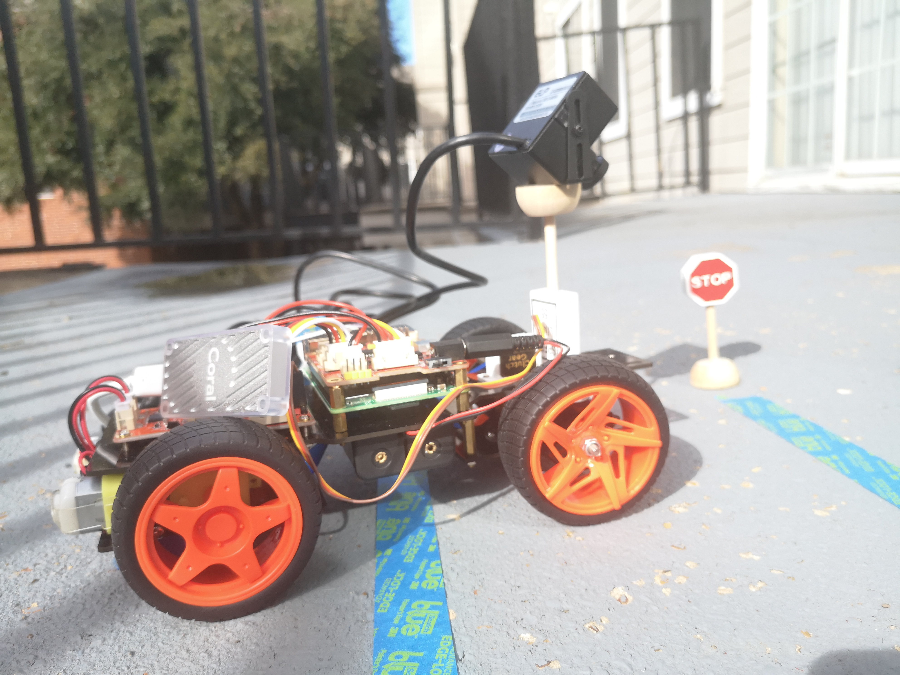
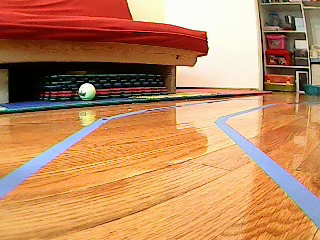
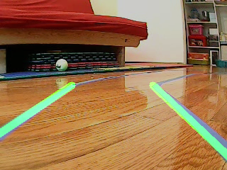
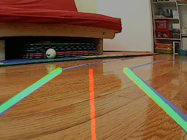
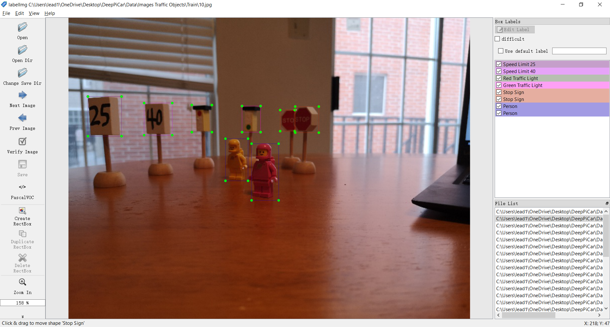
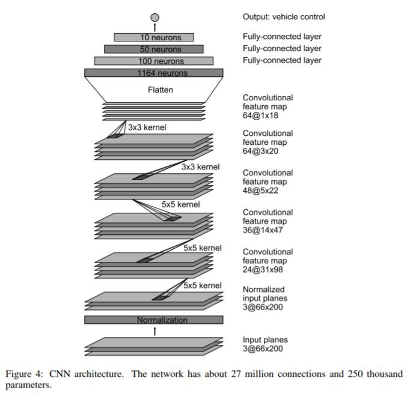
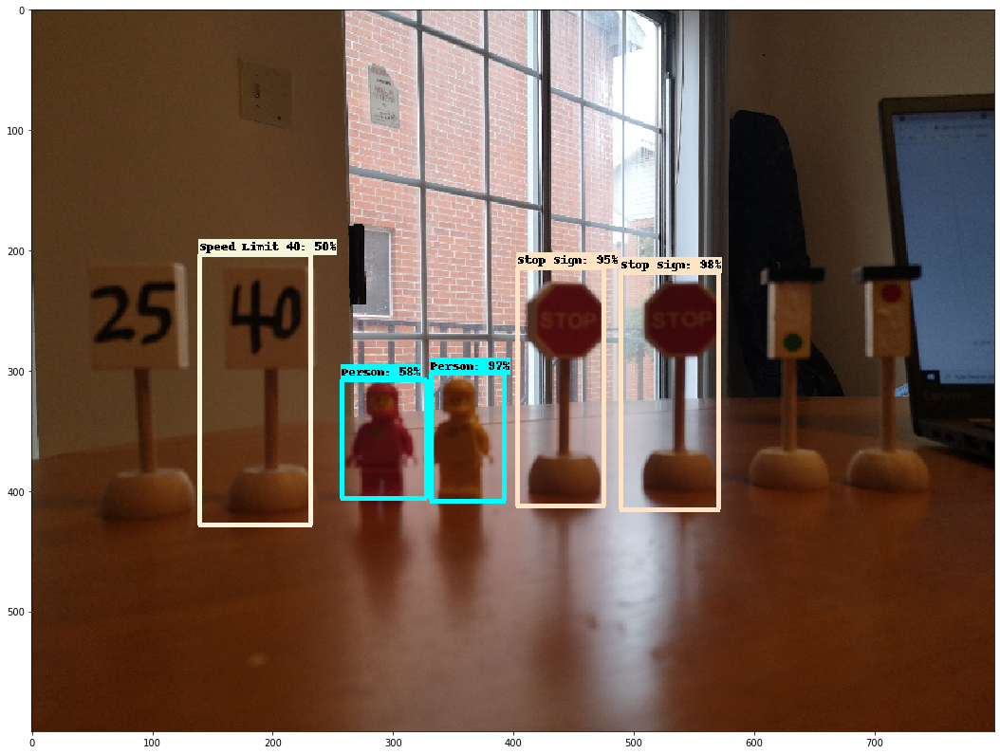

# Self-driving car implemented with a Raspberry Pi and TensorFlow
Xiang Zhao and Zhiyue Ding

This project reproduces David Tian's DeepPiCar project on [github](https://github.com/dctian/DeepPiCar).



After training, this car will be able to drive it self along the lanes (curve or straight), and respond to different traffic objects. For example, it will stop 3 sec before a stop sign. The inference of detection of traffic object is utilizing a Google TPU (coral). Therefore, we need two CNN models to achieve two goals. The first model (**EndToEndLaneFollower**) is in charge of following lanes, the second model (**ObjectsOnRoadProcessor**) deals with the traffic objects on the road. 

## 1. Introduction
There is no doubt that we , human  beings, are in the beginning of era of Artificial Intelligence (AI). AI is catching up our intelligence more and more rapidly.  At the ILSVRC 2015, the so-called Residual Neural Network (ResNet) achieves a error rate of 3.57% which beats human-level performance on this dataset. This ReNet is a convolutional neural network (CNN), which is a class of [deep neural networks](https://en.wikipedia.org/wiki/Deep_neural_network)(DNN). Today's AI is mostly based on DNN. In this project, we will use the other two variants of CNN to make our car see the world. We will deeply dive into this later. Once the car have the vision, it can drive itself with a few lines of codes. This document is organized as follows: in section 2, we discuss how to set up the SunFounder PiCar-V (PiCar) and Raspberry Pi; in section 3, we investigate the method used to generate the training data; in section 4, we presents two CNNs, one is dedicated to following the lanes, the other is in charge of processing the traffic objects; in section 5, we demonstrate our car is actually autonomous.

## 2. Setup
| Hardware                                           | Software   |
| -------------------------------------------------- | ---------- |
| Raspberry Pi 3 Model B+ kit with 2.5A Power Supply | Python 3.x |
| 64 GB micro SD Card                                | OpenCV     |
| SunFounder PiCar-V kit                             | Tensorflow |
| 18650 batteries (4) and  battery charger           |            |
| Google Edge TPU USB Accelerator                    |            |
| Miniature Traffic Signs  and a few Lego figurines. |            |

* Install operating system on Raspberry Pi, [step-by-step](https://projects.raspberrypi.org/en/projects/raspberry-pi-setting-up). 

* Enable remote access to Raspberry Pi, [step-by-step](./doc/remote_access_to_raspberry_pi.pdf).

* Install USB webcam application, [step-by-step](./doc/Cheese.pdf).

* Install PiCar API on Raspberry Pi, [step-by-step](./doc/sunfounder_picar_V_API.pdf).

* Assemble PiCar, [step-by-step](https://www.sunfounder.com/learn/download/X1BWQ19SYXNwYmVycnlfUGlfU21hcnRfVmlkZW9fQ2FyX1YyLjAucGRm/dispi), [video](https://www.youtube.com/watch?v=Tg_g4YoAZdc&list=PLwWF-ICTWmB6TJ9_kBLL4r_P4yszQycoU).

* Calibrate PiCar, [step-by-step](./doc/Calibration.pdf).

* Install OpenCV, [step-by-step](./doc/open_cv.pdf).

* Install Tensorflow, [step-by-step](./doc/Tensorflow.pdf).

## 3. Training data

For EndToEndLaneFollower, the inputs are the real-time frames taken by the webcam, and the output is the steering angle. For ObjectsOnRoadProcessor, the inputs are same, the outputs are classes such as stop sign, speed limit. Thus, we need two kinds of training data, one is ` data_A = [frame, steering_angle]`, the other is `data_B=[frame, class, box]`.

### data_A

We  use a program `save_training_data.py ` [(Link)](https://github.com/lead14r/DeepPiCar/blob/master/driver/code/save_training_data.py) to generate `data_A`  because it's time-consuming to do it by hand.  This python program utilize OpenCV's image processing functions to calculate steering angle for each frame. The basic logic is to extract lane lines first.

|                Original Frame (left)                 |       Frame with extracted Lane Lines (right)        |
| :--------------------------------------------------: | :--------------------------------------------------: |
|  |  |

Then calculate steering angle based on extracted lane lines. 




The direction of PiCar (red line) is determined by averaging far ends points of both lane lines. Note that the lower end of the red line is always in the middle of the bottom of the screen, that’s because we assume the webcam is installed in the middle of the car and pointing straight ahead. Then steering angle is just the angle between vertical-axis and red line.

With this program at hand, we control the PiCar to move following the lanes while recording the video. then we generating data by the command below.

```
pi@raspberrypi:~/DeepPiCar/driver/code $ python3 save_training_data.py ~/Videos/video03
```

It outputs pictures with names like `video03_212_086.png`, the last three number is the steering angle `086`. Note that for PiCar, 45-90 is left, 90-135 is right, and 90 is straight. The below is an example of our training data.

### data_B

We generate `data_B` without programing, since it's not time-consuming.

We have 6 object types, namely, Red Light, Green Light, Stop Sign, 40 Mph Speed Limit, 25 Mph Speed Limit, and a few Lego figurines as pedestrians. So I took about 30 photos similar to the above and placed the objects randomly in each image. Using the below [program](https://github.com/lead14r/DeepPiCar/blob/master/models/object_detection/code/resize_images.py) to resize the images.

```
python C:\Users\lead1\OneDrive\Desktop\DeepPiCar\resize_images.py --raw-dir "C:\Users\lead1\OneDrive\Desktop\DeepPiCar\Images 2" --save-dir "C:\Users\lead1\OneDrive\Desktop\DeepPiCar\Images 3" --ext jpg --target-size "(800, 600)"
```

Then using [labelImg](https://tzutalin.github.io/labelImg/) to annotate images. (1 hour)



## 4 CNNs

**EndToEndLaneFollower** used a simple CNN proposed by NVIDIA [(Link)](./doc/nvidia_1604.07316.pdf).



```python
def nvidia_model():
    model = Sequential(name='Nvidia_Model')
    
    # elu=Expenential Linear Unit, similar to leaky Relu
    # skipping 1st hiddel layer (nomralization layer), as we have normalized the data
    
    # Convolution Layers
    model.add(Conv2D(24, (5, 5), strides=(2, 2), input_shape=(66, 200, 3),\	                 activation='elu')) 
    model.add(Conv2D(36, (5, 5), strides=(2, 2), activation='elu')) 
    model.add(Conv2D(48, (5, 5), strides=(2, 2), activation='elu')) 
    model.add(Conv2D(64, (3, 3), activation='elu')) 
    model.add(Dropout(0.2)) # not in original model. added for more robustness
    model.add(Conv2D(64, (3, 3), activation='elu')) 
    
    # Fully Connected Layers
    model.add(Flatten())
    model.add(Dropout(0.2)) # not in original model. added for more robustness
    model.add(Dense(100, activation='elu'))
    model.add(Dense(50, activation='elu'))
    model.add(Dense(10, activation='elu'))
    
    # output layer: turn angle (from 45-135, 90 is straight, <90 turn left, >90 turn         right)
    model.add(Dense(1)) 
    
    # since this is a regression problem not classification problem,
    # we use MSE (Mean Squared Error) as loss function
    optimizer = Adam(lr=1e-3) # lr is learning rate
    model.compile(loss='mse', optimizer=optimizer)
    
    return model

model = nvidia_model()
print(model.summary())
```

The full Jupyter Notebook used to train the model can be found on [Github](https://github.com/lead14r/DeepPiCar/blob/master/models/lane_navigation/code/end_to_end_lane_navigation.ipynb).

**ObjectsOnRoadProcessor** is based on [MobileNet](./doc/mobile_net_1704.04861.pdf) and [SSD](./doc/ssd_1512.02325.pdf), also utilizes transfer learning technique. Specifically, we have done the following steps to adapt the pre-trained model to our case :

* Image collection and labeling (1 hour)
* Quantized trained SSD with MobileNet v2 on MSCOCO Dataset has been selected from [Google Model Zoo](https://github.com/tensorflow/models/blob/master/research/object_detection/g3doc/detection_model_zoo.md).
* Transfer learning/model training (3–4 hours)
* Save model output in Edge TPU format (5 min)
* Run model inferences on Raspberry Pi

The full Jupyter Notebook used to train the model can be found on [Github](https://github.com/lead14r/DeepPiCar/blob/master/models/object_detection/code/tensorflow_traffic_sign_detection.ipynb).



After training, PiCar can detect and identify what objects are in front of it, we still need to tell it what to do with them, i.e. motion control.  The codes are also in our Github. 

* [traffic_objects.py](https://github.com/lead14r/DeepPiCar/blob/master/driver/code/traffic_objects.py).

* [object_on_road_processor.py](https://github.com/lead14r/DeepPiCar/blob/master/driver/code/objects_on_road_processor.py).

The rules are pretty simple: if no object is detected, then drive at the last known speed limit. If some object is detected, that object will modify car’s speed or speed limit.

## 5 Results

* [Video 1](https://www.youtube.com/watch?v=uJVD-99SaUQ)
* [Video 2](https://www.youtube.com/watch?v=191kxmClAb0&t=35s)
* [Video 3](https://www.youtube.com/watch?v=joa1y8AXkQQ)

From videos, it is clear that the car is driving itself and capable of detecting the traffic objects. You may find that the latency still exits. Even though we have deployed **ObjectsOnRoadProcessor** on Edge TPU, the CPU of raspberry pi is still running the **EndToEndLaneFollower** model as well as video processing program. 

